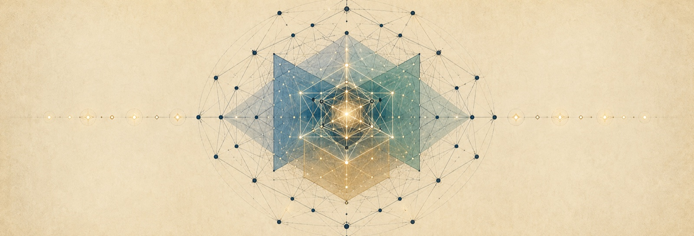

# From Chirality to the Standard Model

<p align="center">
  <strong>A uniqueness and no-go theorem for compact Lie-algebra embeddings</strong><br />
  <em>What if chirality fixed the structure of matter?</em>
</p>

<p align="center">
  <a href="https://emad-ii.github.io/chirality-standard-model/"></a>
  <a href="paper/paper.pdf"></a>
  <a href="https://colab.research.google.com/github/emad-ii/chirality-standard-model/blob/main/Cubic_Anomaly_Master_Verification.ipynb"></a>
  <a href="media/README.md"></a>
</p>

<p align="center">
  
</p>

Matter in the Standard Model is chiral. Left- and right-handed fields carry different electroweak charges. In 1957, [Wu and her collaborators](https://doi.org/10.1103/PhysRev.105.1413) made nature’s distinction between left and right experimentally unmistakable.

Usually, a model begins by choosing a gauge algebra, its matter representations and their multiplicities, then checking anomaly cancellation. Reverse the question: **can the representation come from the symmetry embedding itself, with chirality and its cubic anomaly fixing the pair?**

Within the domain below, exactly one pair survives.

## One pair. Threefold chiral content.

Start with an effective proper inclusion of finite-dimensional compact real Lie algebras $\mathfrak h\subsetneq\mathfrak g$. Effective means that no nonzero ideal of $\mathfrak g$ lies inside $\mathfrak h$. Take the **entire adjoint complement** $q=\mathfrak g/\mathfrak h$, and impose two conditions:

$$
\mathrm{End}_{\mathfrak h}(q)\cong\mathbb C,
\qquad
\mathrm{Rad}(c_V)\ne 0.
$$

The first makes $q$ real-irreducible of complex type, with $q_{\mathbb C}=V\oplus V^{\ast}$ and $V\not\cong V^{\ast}$. The second asks that the cubic trace vanish whenever one input belongs to a nonzero ideal, with the other two ranging over all of $\mathfrak h$.

The unique solution, up to duality, is

$$
\mathfrak e_8\supset\mathfrak e_6\oplus\mathfrak{su}(3)_M,
\qquad
V=\mathbf{27}\boxtimes\mathbf3,
\qquad
\mathrm{Rad}(c_V)=\mathfrak e_6.
$$

This is a **uniqueness and no-go theorem over the stated domain**: one pair satisfies the conditions; every inequivalent alternative is excluded. No exceptional algebra, rank, representation dimension or family number is selected in advance.

The conditions also yield a compact homogeneous realization $G/H$. Homogeneity is the geometry of the qualifying algebra pair, not an additional assumption about physical spacetime.

## Follow the proof

1. **Classify the embeddings.** Both conditions enter the structural reduction to simple $\mathfrak g$ and maximal semisimple $\mathfrak h$. The all-rank argument excludes rank-deficient cases and reaches six full-rank cubic tests. Only the displayed exceptional pair survives.
2. **Resolve the geometry inside $E_6$.** Exhaust all $27\cdot36\cdot40=38{,}880$ maximal-subsystem triples and their six Weyl orbits. Each triple has a unique largest pairwise derived group. The two extremal orbits give the faithful Standard Model and left-right subgroup chains through this pair-first construction.
3. **Restrict the representation.** Along the identified Standard Model chain, $\mathbf{27}\boxtimes\mathbf3$ contains three minimal family modules, three vector-like $\mathbf5\oplus\overline{\mathbf5}$ pairs and six singlets. Taking the net chiral class gives $\chi(V)=3\chi(F_{\mathrm{SM}})$; duality reverses the sign.

The [paper](paper/paper.pdf) gives the argument in full. The [interactive website](https://emad-ii.github.io/chirality-standard-model/) opens it at four levels, from the experiments and the language of symmetry to the equations and certificates. Its animated exhibits, root geometry and films all live in this repository.

## Run it yourself

Open the [master notebook in Colab](https://colab.research.google.com/github/emad-ii/chirality-standard-model/blob/main/Cubic_Anomaly_Master_Verification.ipynb) and choose **Runtime → Run all**. Python verification uses only the standard library. Enable **Run Lean** in the notebook for the pinned Lean 4 / Mathlib checks.

For local use, open [the notebook](Cubic_Anomaly_Master_Verification.ipynb) in Jupyter, or run:

```sh
python3 verification/python/run_all.py
```

The notebook records the source revision separately from the mathematical certificate. Two root realizations and two different subsystem-enumeration algorithms reconstruct the finite results. Corrupted-data tests check that invalid certificates are rejected.

| Method | What it establishes |
| :--- | :--- |
| **Manuscript proofs** | Structural reductions, completeness, invariant theory, global groups and branching |
| **Exact Python computation** | Independent root realizations, complete finite censuses, subgroup kernels and chiral dimensions |
| **Lean 4 / Mathlib** | 25 exported finite theorems covering the exceptional census, cubic selector, $E_6$ incidence and intrinsic pair ordering |

The [verification notes](verification/README.md) describe each check and the `native_decide` trust model.

## Everything in one place

| Read or explore | Source |
| :--- | :--- |
| Main paper | [PDF](paper/paper.pdf) · [LaTeX](paper/paper.tex) |
| Original note · April 2026 | [Two-page PDF](paper/short-note/paper-iii.pdf) · [LaTeX](paper/short-note/paper-iii.tex) · [historical context](paper/short-note/README.md) |
| Master verification notebook | [Colab](https://colab.research.google.com/github/emad-ii/chirality-standard-model/blob/main/Cubic_Anomaly_Master_Verification.ipynb) · [Jupyter](Cubic_Anomaly_Master_Verification.ipynb) |
| Interactive website and illustrations | [Live site](https://emad-ii.github.io/chirality-standard-model/) · [source and build instructions](website/README.md) |
| Equation film and selection pilot | [Videos, captions and editable source](media/README.md) |
| Exact checks and finite formalization | [Python and certificates](verification/) · [Lean](CubicAnomaly/) · [scope and trust model](verification/README.md#trust-model) |

[Download the complete repository](https://github.com/emad-ii/chirality-standard-model/archive/refs/heads/main.zip) to keep the papers, proofs, website and films together.

## Challenge the mathematics

Use the [independent-review prompt](docs/INDEPENDENT_MATH_AUDIT.md) with the complete sources. Ask for counterexamples, omitted cases and unjustified transitions, with precise locations and checks actually performed.

<p align="center">
  <a href="https://chatgpt.com/?q=Independently%20review%20From%20Chirality%20to%20the%20Standard%20Model%20at%20https%3A%2F%2Fgithub.com%2Femad-ii%2Fchirality-standard-model.%20Read%20the%20complete%20paper%20and%20inspect%20the%20notebook%2C%20exact%20Python%20verification%20and%20finite%20Lean%20theorems.%20Audit%20the%20effective%20compact%20Lie-algebra%20domain%2C%20entire%20adjoint%20complement%2C%20complex%20type%20and%20nonzero%20cubic%20radical%3B%20verify%20that%20both%20conditions%20support%20the%20structural%20reduction.%20Check%20all-rank%20completeness%2C%20the%20six%20cubic%20tests%2C%20E6%20incidence%20and%20the%20threefold%20net%20chiral%20class.%20Treat%20the%20two-page%20note%20as%20a%20separate%20maximal%20two-factor%20classification.%20Seek%20counterexamples%2C%20omitted%20cases%20and%20circular%20verification.%20Cite%20exact%20locations%2C%20the%20source%20revision%20and%20checks%20actually%20run.%20Distinguish%20manuscript%20proofs%2C%20computation%20and%20Lean's%20disclosed%20trust%20model.%20Request%20the%20PDF%20and%20ZIP%20if%20you%20cannot%20access%20the%20sources."></a>
  <a href="https://claude.ai/new"></a>
  <a href="https://gemini.google.com/app"></a>
  <a href="https://grok.com/?q=Independently%20review%20From%20Chirality%20to%20the%20Standard%20Model%20at%20https%3A%2F%2Fgithub.com%2Femad-ii%2Fchirality-standard-model.%20Read%20the%20complete%20paper%20and%20inspect%20the%20notebook%2C%20exact%20Python%20verification%20and%20finite%20Lean%20theorems.%20Audit%20the%20effective%20compact%20Lie-algebra%20domain%2C%20entire%20adjoint%20complement%2C%20complex%20type%20and%20nonzero%20cubic%20radical%3B%20verify%20that%20both%20conditions%20support%20the%20structural%20reduction.%20Check%20all-rank%20completeness%2C%20the%20six%20cubic%20tests%2C%20E6%20incidence%20and%20the%20threefold%20net%20chiral%20class.%20Treat%20the%20two-page%20note%20as%20a%20separate%20maximal%20two-factor%20classification.%20Seek%20counterexamples%2C%20omitted%20cases%20and%20circular%20verification.%20Cite%20exact%20locations%2C%20the%20source%20revision%20and%20checks%20actually%20run.%20Distinguish%20manuscript%20proofs%2C%20computation%20and%20Lean's%20disclosed%20trust%20model.%20Request%20the%20PDF%20and%20ZIP%20if%20you%20cannot%20access%20the%20sources."></a>
  <a href="https://chat.deepseek.com/"></a>
  <a href="https://www.perplexity.ai/"></a>
</p>

ChatGPT and Grok receive a prefilled request. For the others, paste the linked prompt. Model agreement is supplementary review, not a substitute for proof.

---

**Emad Mostaque · 6 September 2026**

*For my son Noah, on his eighteenth birthday.*

[Cite the work](CITATION.cff) · [Permissions](LICENSE.md)

Repository, computational verification, interactive website and video materials created with **GPT-6 Astra**.
